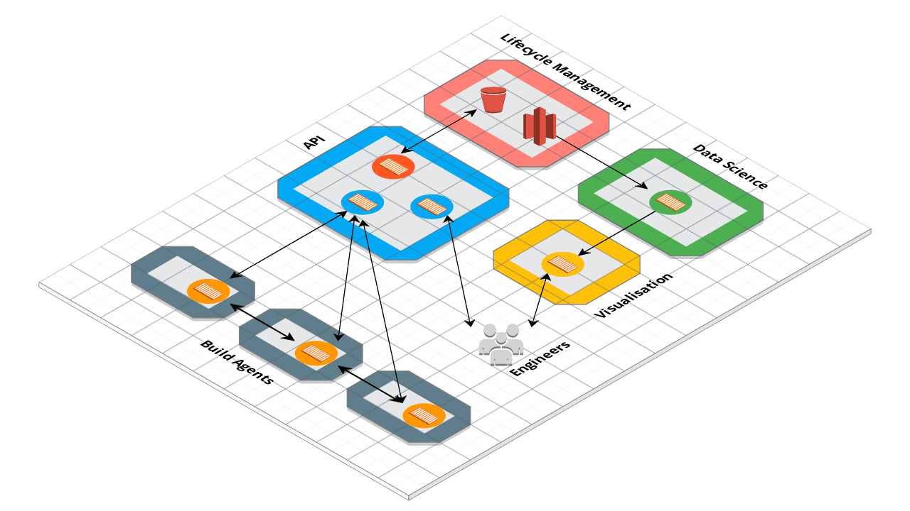

# Hangar
Next-Generation, Cloud-Native, Distributed Artefact Management System

## Concept
For most, the artefact management systems in the market are fine. They let you upload and download artefacts and if you are feeling extra special, you might actually put authentication on it. Other than that, the system does what it needs to do to allow you to share artefacts in a company without too much hassle.

However, as you start to scale, artefact management becomes a blocker. The costs of storage, networking, operations (back-ups/restorations/uptime) start to add up but more fundamental than that, there's a cost to your business through a slowing down of delivery velocity as your builds get longer and your developers are sitting about waiting. 

When you hit that point, there are **no** artefact management solutions on the market that can help you. 

## Why is this different?
Hangar is different than any other system on the market as it assumes that you are working in the *cloud* rather than in a *datacentre*. That seems like marketing nonsense but there are some serious differences when architecting for the cloud that no offering on the market takes into account (or have tried to shoehorn little bits to make it seem like they've have). 

By being cloud-native from the very start, Hangar will assume everything you do will involve a *cost* so you are trying to run as little as possible to serve a requirement. Some examples...

- Your build agents are immutable and scale up and down over the course of the day as you don't want to be running agents that aren't doing anything.
- The storage of artefacts in a disk will be expensive over time, especially frustrating are those artefacts that have only been downloaded once but are still in storage.
- With [blue/green deployments](https://martinfowler.com/bliki/BlueGreenDeployment.html) having been around for almost a decade, you consider downtime to be [a travesty](https://www.merriam-webster.com/dictionary/travesty) and avoided when possible.
- Moving artefacts around your estate will incur a cost (cross-AZ, NAT gateway etc) so you'd rather send as little data as possible.
- You don't expect to have to operate a service that may exist natively in your cloud provider - one of the main reasons you moved there actually...

Is this too much to ask? We don't think so. 

## How does it work?
Here's the initial design for the v1.0 state. It may change over time and we plan to deliver smaller milestones along the way to get the value as soon as possible. 

